# Deep learning - Wine Quality challenge

# Description
This was a project during training time at BeCode.  
We were provided with a wine dataset which contained data on red and white wines. The dataset of this assignment is a combination of <a href=https://archive.ics.uci.edu/ml/datasets/wine+quality target="_blank">a red wine and a white wine dataset</a>. The combined dataset consists of 6497 wines, each with 11 features and a target value. 

# Goal
1. Prepare data for a neural network
2. Use a deep learning library to construct and train a neural network model. 
3. Tune the hyperparameters to improve the performance. 
4. The goal of the model is to predict bad and good wines. 

# Installation
### Python version
* Python 3.9

### Packages used
* pandas==1.3.2
* scikit-learn==0.24.2
* matplotlib==3.4.3
* tensorflow==2.3.0

# Usage
### Root folder
| File            | Description                                                 |
|-------------------|-------------------------------------------------------------|
| data/wine_full.csv| Original csv-file with wine data                            |
| utils/manipulate_data.py | Python script containing functions for dataset manipulation|
| utils/visualise.py | Python script containing functions for plotting the data | 
| utils/create_model.py | Python script containing functions for constructing a base model for grid searching   |
| utils/grid_search.py | Python script containing functions for performing grid search on a neural network   |
| visuals          | Directory containing graphics                               |
| notebooks        | Directory containing the notebooks used                     |
| main.py          | Python script with the final version of the project | 

# Binary Classification

## Target values

- I will construct a binary classifier. 
- I divide target values into two categories (0 and 1) with the mean of the quality as a threshold:

| original quality values            | binary quality value         |
|-------------------|----------------------------------------------|
| 3, 4, 5 | 0 (bad)                         |
| 6, 7, 8, 9 | 1 (good) | 

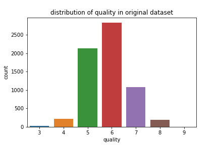 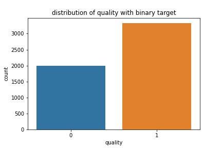

- In choosing the mean as the threshold, the good wines are overrepresented in the dataset.

## Model architectures
### A first, random model

### Perform RandomGridCV and GridSearchCV to hypertune parameters

Below are the values I used to define some hyperparameters:

##### Random grid search

| hyperparameter      | value domain          | best value
|:-------------------:|:---------------------:|:--------------:|
| number hidden layers |  [1, 6], step=1       |      1       |
| number neurons per layer | [1, 100], step=1  |      49      | 
| learning rate |[0.0001, 0.004], step=0.00005 |      0.0033  |

##### Grid search

| hyperparameter      | value domain          | best value
|:-------------------:|:---------------------:|:--------------:|
| number neurons per layer | [40, 60], step=2  |      49       | 
| learning rate |[0.00250, 0.00350], , step=0.0001 |   0.0033  |

##### Used hyperparameters after grid search

| hyperparameter      | used value 
|:-------------------:|:---------------------:|
| number of hidden layers | 1 | 
| number neurons per layer | 40   | 
| learning rate |0.0033 |

### Model architecture after grid search

## Compare the two models 

### Accuracies

* Accuracy scores after grid searching barely improve. 
* According to the accuracies, there is no overfitting. EarlyStopping was used in the model fitting.  

<!-- -->

| set  | base model  | grid searched model | 
|-------|--------------|----------|
| train | 0.772   |0.780  |
| validation | 0.732 | 0.754  |
|  test | 0.751 |0.759  | 

#### ROC curve

- According to these metrics, the models perform very similar

 

<!-- -->

## Feature engineering

The models above are trained on an imbalanced training set (more good wines than bad wines). I made the following changes to the data:

### Separate good and bad wines of quality 6
* Separate wines of quality 6 into two groups: one bad and one good.
* Use t-SNE to decide how to divide these wines into two groups. 
* Compare wines of quality 5, 6 and 7

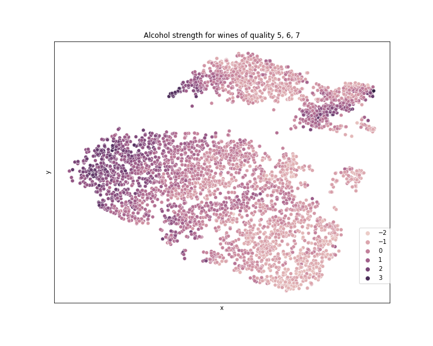 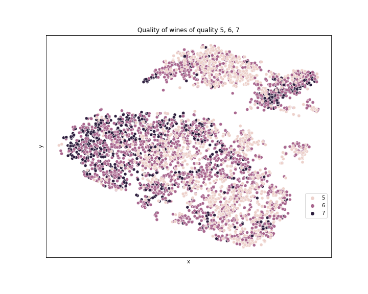

* Quality and alcohol have the best correspondence, as can be seen on the graphs
* Choose a threshold to separate wines of quality 6 according to alcohol level (the higher, the better)
* The new distribution of the target class is more balanced:

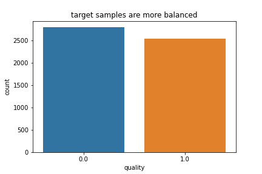

### Try the neural network on the new dataset

* I used the grid searched model on this feature engineered dataset

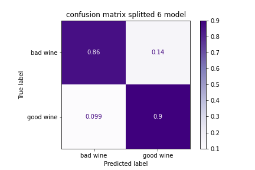

#### ROC curve

* I tried the same model on a dataset where I dropped some features

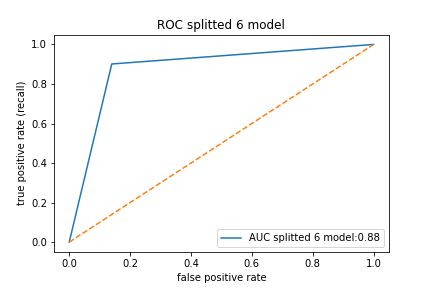 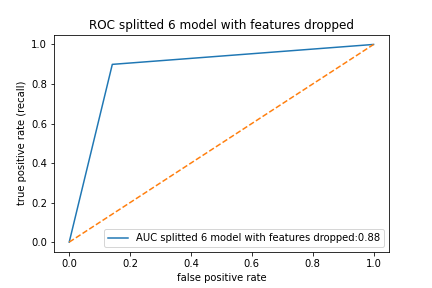

##### Accuracies of all 4 models

| set  | base model | grid searched model | splitted dataset model | features dropped model |  
|-------|------|-----|----------|----------|
| train | 0.772     | 0.780  | 0.880 | 0.867|
| validation | 0.732   |      0.754  |  0.844| 0.853|
|  test |  0.751    | 0.759  | 0.867 | 0.878|

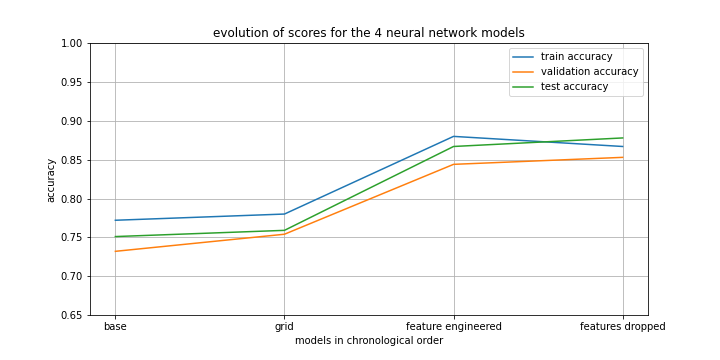 

## Comparing RandomForest performance on two datasets

* the RandomForestClassifier model is initialized with max_depth=2 to avoid overfitting. 

| set  | without feature engineering | with feature engineering |
|-------|------|-----|
| train | 0.717     | 0.860 |
| validation | 0.720   | 0.860    |
|  test |  0.730    |  0.842 |

* RandomForest gets biased towards good wines in the dataset without engineering.  
* Feature engineering on the model improves this bias a lot.

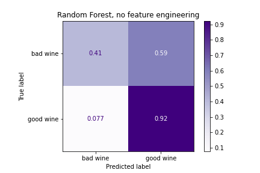 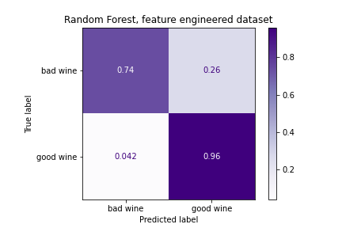

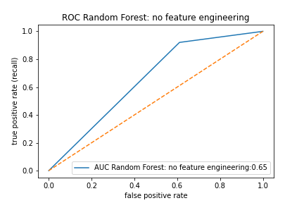 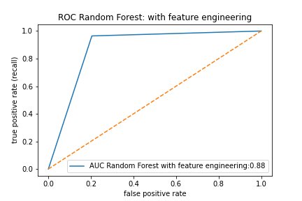

### Conclusions 

* Grid searching suggested a more simple model. The resulting hyper-parameters didn't have an impact on the performance of the model.
* Feature engineering was the big step forward. Performance improved a lot after the dataset was altered. This conclusion stands for the neural network as well as for the Random Forest Classifier.
* In this assignment, feature engineering was more succesful than hypertuning a neural network model.

# Contributor
| Name                   | Github                              |
|------------------------|-------------------------------------|
| Maarten Van den Bulcke | https://github.com/MaartenVdBulcke  |

# Timeline
07/09/2021 - 09/09/2021
