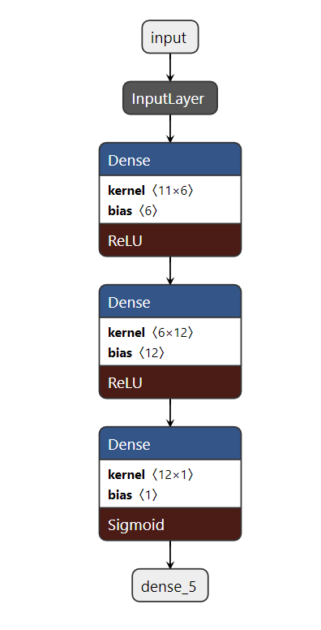
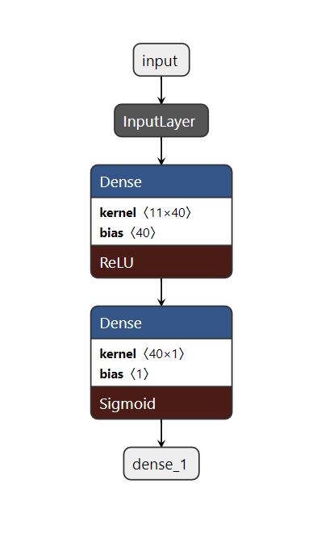
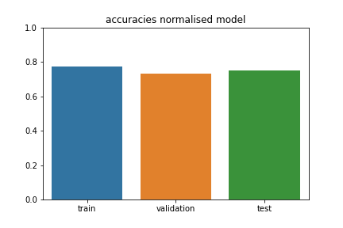
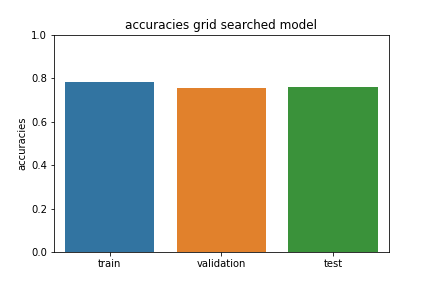
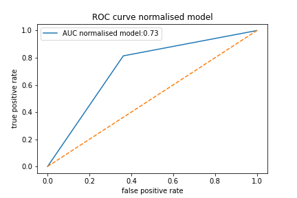
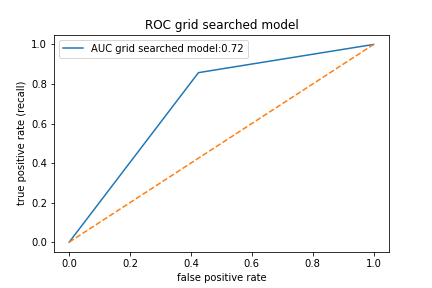
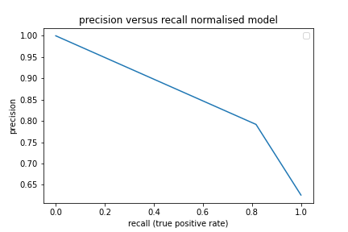
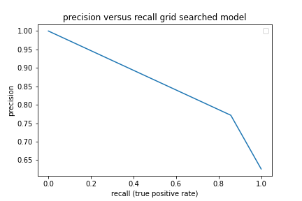

# Deep learning - Wine Quality challenge

# Description
This was a project during training time at BeCode.  
We were provided with a wine dataset with contained data on red and white wines. The dataset of this assignment is a combination of <a href=https://archive.ics.uci.edu/ml/datasets/wine+quality target="_blank">a red wine and a white wine dataset</a>. The combined dataset consists of 6497 wines, each with 11 features and a target value. 

# Goal
1. Train a neural network model to distinguish good from bad wines. 
2. Tune the hyperparameters to improve the performance. 

# Installation
### Python version
* Python 3.9

### Packages used
* pandas==1.3.2
* scikit-learn==0.24.2
* matplotlib==3.4.3
* tensorflow==2.3.0

# Usage
### Root folder
| File            | Description                                                 |
|-------------------|-------------------------------------------------------------|
| data/wine_full.csv| Original csv-file with wine data                            |
| utils/manipulate_data.py | Python script containing functions for dataset manipulation|
| utils/visualise.py | Python script containing functions for plotting the data | 
| visuals          | Directory containing graphics                               |
| main.py          | Python script with the final version of the project | 

# Stages of the project 

## Binary classifier 
Divide target values into two categories (0 or 1) with the mean as threshold:

| original quality values            | binary quality value         |
|-------------------|----------------------------------------------|
| 3, 4, 5 | 0 (bad)                         |
| 6, 7, 8, 9 | 1 (good) | 

### Comparing a random base model to grid searched 

#### Model architecture
##### Base model 

##### RandomGridCV and GridSearchCV

Below are the values I used to define the some hyperparameters:

###### Random grid search

| hyperparameter      | value domain          | best value
|:-------------------:|:---------------------:|:--------------:|
| number hidden layers |  [1, 6], step=1       |      1       |
| number neurons per layer | [1, 100], step=1  |      49      | 
| learning rate |[0.0001, 0.004], step=0.00005 |      0.0033  |

###### Grid search

| hyperparameter      | value domain          | best value
|:-------------------:|:---------------------:|:--------------:|
| number neurons per layer | [40, 60], step=2  |      49       | 
| learning rate |[0.00250, 0.00350], , step=0.0001 |   0.0033  |

###### Used hyperparameters after grid search

| hyperparameter      | used value 
|:-------------------:|:---------------------:|
| number of hidden layers | 1 | 
| number neurons per layer | 40   | 
| learning rate |0.0033 |

##### model architecture after grid search

#### Accuracies

 

| set  | base model  | grid searched | 
|-------|--------------|----------|
| train | 0.772   |0.780  |
| validation | 0.732 | 0.754  |
|  test | 0.751 |0.759  | 

- there is no overfitting
- grid searching does not improve the model

#### ROC curve & precision-recall 

- According to these metrics, the models perform very similar

  

  

# Contributor
| Name                   | Github                              |
|------------------------|-------------------------------------|
| Maarten Van den Bulcke | https://github.com/MaartenVdBulcke  |

# Timeline
07/09/2021 - 09/09/2021
